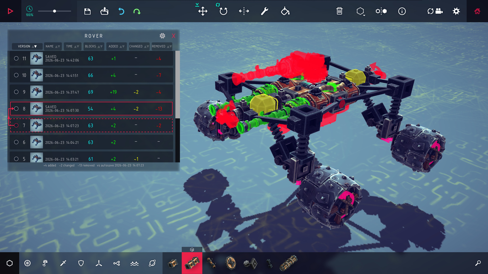
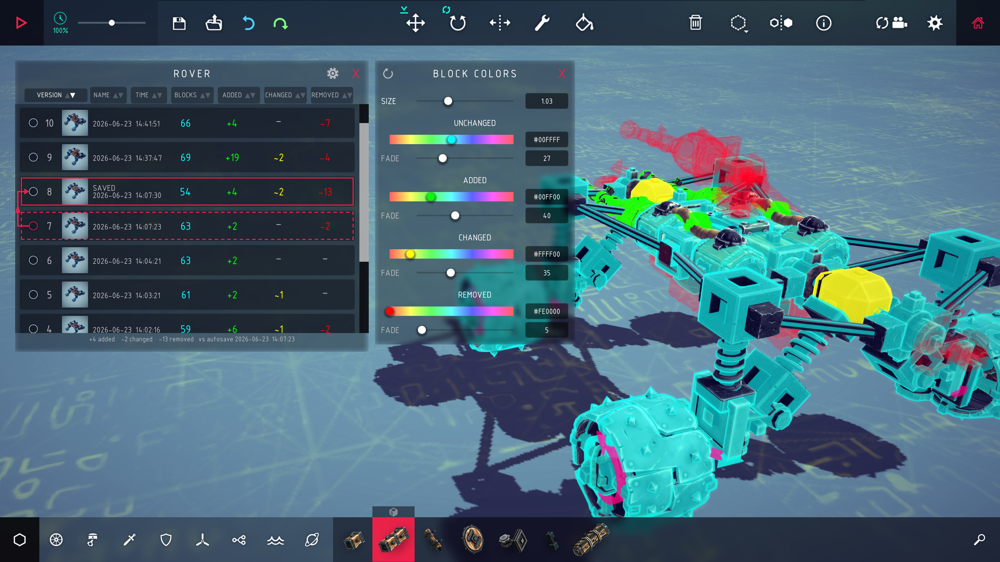
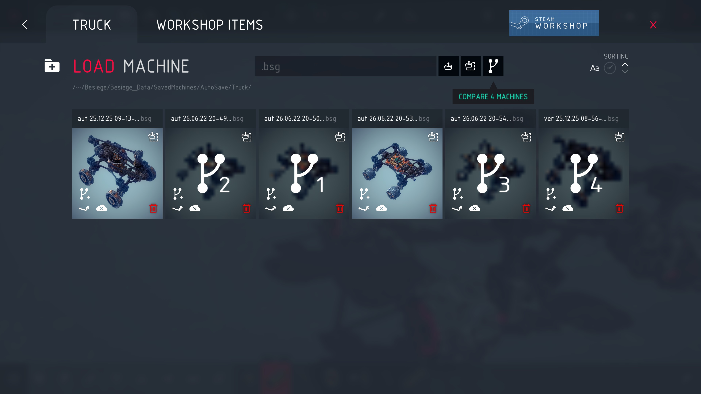
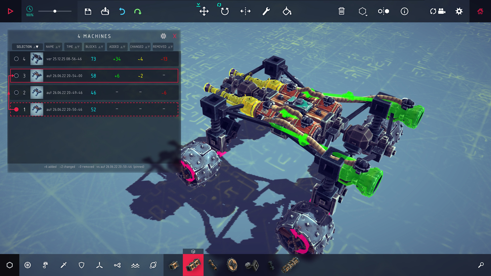

# Git View

See what changed between two versions of a machine, in [Besiege](https://store.steampowered.com/app/346010/Besiege/).



Besiege has kept a backup of your machine every minute and every save for years,
in `SavedMachines/AutoSave`. Its own versions button drops you in a folder of a
hundred files called `aut 26.06.27 15-34-37` and leaves you to guess. This mod
reads that history and shows you the blocks that changed.

**Requires [UI Factory](https://steamcommunity.com/sharedfiles/filedetails/?id=2913469777)**
(another Besiege mod which enables the nice UI, see workshop item `2913469777`) or the mod won't load.

## Install

Either subscribe to the mod on Steam, or if you don't use Steam you can clone the repo then:

```sh
./tools/install.sh              # symlink into Besiege_Data/Mods
./tools/install.sh --copy       # copy instead
./tools/install.sh --uninstall
```

Set `BESIEGE_DIR` if your install isn't found automatically.
Start Besiege, enable **GitView** in the mods menu, and enter a level, the sandbox or the level editor.

## Opening a history

Click the branch icon on the screen to load a machine: either on an autosave folder or select multiple machines and compare them.
The newest/last selected machine loads with a window besides it where each row is a different autosave or individually selected machine.
The number on the left is the autosave's place in the history (1 is oldest).

Click a row and that machine loads, framed in red, with the changes made from the machine below it (the previous version when using an autosave folder) drawn over the machine as ghost blocks:
**green** added, **yellow** changed, **red** deleted.

You can sort the different machines by version number (or manual selection order), name, time saved, total number of blocks, and number of blocks added / changed / removed.

You can pin a specific machine to be used as the source by clicking the left circle (it will become a filled red circle).
Then the number of blocks are re-calculated against this pinned machine and selecting any other machine will compare it against this one.

Overlay colors, transparency and size are editable using the cog/gear icon in the top right of the comparison window.
You can show/hide the comparison window with `Ctrl+Y`.

## Block colors



The cog opens an option menu to edit the **size** of the overlayed blocks and the four **colors** for the:
unchanged, added, changed, and removed blocks.
**Transparency** of each color overlay is also changeable.

## Comparing machines that are not versions of each other



Every machine in the load screen has a small branch icon in the corner of its thumbnail.
Click it to add the machine for comparison. Its thumbnail will darken and a numbered is shown to indicate its order in the list.
Click the icon on another machine and a compare button appears at the top of the screen, beside the load buttons.



Click the comparison button and the last machine selected will load, alongside the window showing a list of the machines selected.
In the screenshot above, machine 3 is on screen and machine 1 is pinned so every block count is computed against machine 1.

Autosave folders cannot be picked, instead they load all autosaves **BUT** the versions inside the folder can be selected individually.

## What counts as a change

Blocks are paired by the identifier Besiege writes into the save file which is usually correct but sometimes not as the game re-generates an identifier when a block is copied, mirrored or restored by an undo.

Positions, rotations and settings are compared with a tolerance (stored as decimal text).
Some settings hold float values that may ever so slightly change every save.
A block that is both added and changed only counts as added.

A block whose *skin* changed may not be reported as changed.
Skins are only resolved when a save is loaded for real, and the history is read without doing that.

## Notes

Details land in `Player.log` and in the in-game console with `show_logs true`.

AI agent? see [AGENTS.md](AGENTS.md) for layout, build, and any relevant info.
[docs/MODDING-NOTES.md](docs/MODDING-NOTES.md) has some info on Besiege's modding API.

## Licence

MIT. Besiege is Spiderling Studios'; nothing of theirs is redistributed here.
